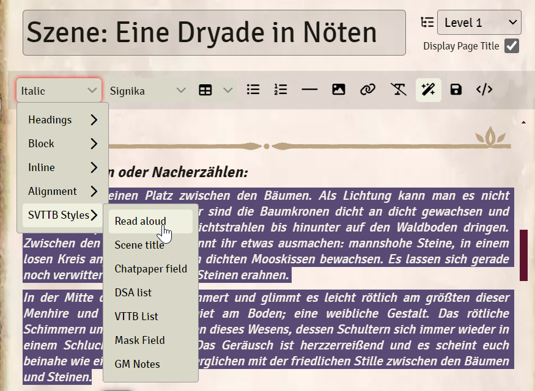

# studio-vtt-bastler-tools
 
This is a module for the virtual tabletop tool "Foundry VTT". We use this as a collective dependecy to be referred to by our main modules. 

Copyright (c) Studio VTT Bastler.  
All rights reserved.

## Functions
### Additional css classes
This module includes additional css classes which we use in our modules.  
All SVTTB modules use this module as requirement.  

If you don't want to use the styling, you can deactivate it in the module settings.  

### Prosemirror Buttons
We added buttons to the Prosemirror Editor. These Buttons add css classes to the selected text.  

For now, these buttons are in beta and should not be used. To activate them anyway open the console via F12 and enter the following command. This should reload the Client and activate the ProseMirror buttons.

```js
game.settings.set("studio-vtt-bastler-tools", "use-prosemirror-buttons", true)
```


